# AS-CrowdStrike-Alerts-Ingestion

Author: Accelerynt

For any technical questions, please contact info@accelerynt.com    

This playbook will create a unidirectional integration with Microsoft Sentinel. It will pull CrowdStrike alerts into a Microsoft Sentinel custom log table where they can be tracked, queried, and correlated with other security data. The playbook includes built-in deduplication to prevent duplicate alerts.


> [!NOTE]  
> Estimated Time to Complete: 1 hour

> [!TIP]
> Required deployment variables are noted throughout. Reviewing the deployment page and filling out fields as you proceed is recommended.

#
### Requirements
                                                                                                                                     
The following items are required under the template settings during deployment: 

* **CrowdStrike API Client ID** - A client ID with permissions to query alerts from your CrowdStrike instance. [Documentation link](https://falcon.crowdstrike.com/documentation/46/crowdstrike-oauth2-based-apis)
* **CrowdStrike API Client Secret** - The client secret associated with your CrowdStrike API client ID.
* **CrowdStrike Base URL** - The base URL for your CrowdStrike API based on your cloud region (e.g., https://api.us-2.crowdstrike.com)
* **Azure Key Vault Secret** - This will be used to store your CrowdStrike API Client Secret. [Documentation link](https://github.com/Accelerynt-Security/AS-CrowdStrike-Alerts-Ingestion#create-azure-key-vault-secret)
* **Log Analytics Workspace** - The name, location, subscription ID, resource group, and resource ID of the Log Analytics Workspace that the CrowdStrike alerts will be sent to. [Documentation link](https://github.com/Accelerynt-Security/AS-CrowdStrike-Alerts-Ingestion#log-analytics-workspace)

#
### CrowdStrike API Permissions

The CrowdStrike API client requires the following permissions:

| Scope | Permission |
|-------|------------|
| Alerts | **Read** |

To create an API client in CrowdStrike:

1. Navigate to **Support and resources** > **API Clients and Keys**
2. Click **Create API Client**
3. Enter a client name (e.g., "Microsoft Sentinel Integration")
4. Select the **Alerts: Read** scope
5. Click **Create**
6. Copy the **Client ID** and **Client Secret** - the secret will only be shown once

# 
### Setup

#### Create Azure Key Vault Secret

Navigate to the Azure Key Vaults page: https://portal.azure.com/#view/HubsExtension/BrowseResource/resourceType/Microsoft.KeyVault%2Fvaults

Navigate to an existing Key Vault or create a new one. From the Key Vault overview page, click the "**Secrets**" menu option, found under the "**Settings**" section. Click "**Generate/Import**".


Choose a name for the secret, such as "**AS-CrowdStrike-Integration-Client-Secret**", and enter your CrowdStrike API Client Secret in the "**Value**" field. All other settings can be left as is. Click "**Create**". 

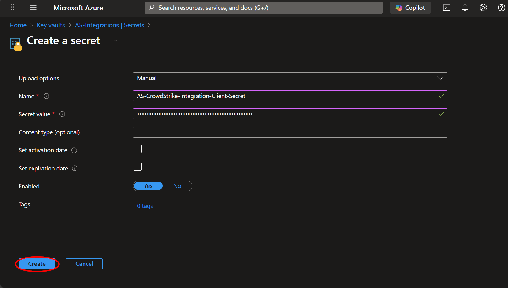


#### Log Analytics Workspace

Navigate to the Log Analytics Workspace page: https://portal.azure.com/#view/HubsExtension/BrowseResource/resourceType/Microsoft.OperationalInsights%2Fworkspaces

Select the workspace that the CrowdStrike alerts will be sent to, and take note of the following values:


From the left menu blade, click **Overview** and take note of the **Name** and **Location** field values. These will be needed for the DCE deployment.

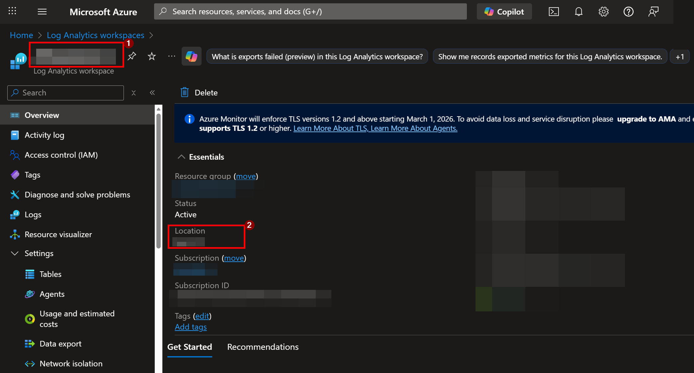

From the left menu blade, click **Overview** and take note of the **Subscription**, **Resource group**, and **Resource ID** shown in the JSON View. These will be needed for the DCR and Logic App deployments.


#
### Deployment                                                                                                         
                                                                                                        
#### Deploy the Custom Table

The custom table **CrowdStrike_Alerts_CL** must be created before deploying the DCR.

[](https://portal.azure.com/#create/Microsoft.Template/uri/https%3A%2F%2Fraw.githubusercontent.com%2FAccelerynt-Security%2FAS-CrowdStrike-Alerts-Ingestion%2Fmain%2FAzureDeployTable.json)
[](https://portal.azure.us/#create/Microsoft.Template/uri/https%3A%2F%2Fraw.githubusercontent.com%2FAccelerynt-Security%2FAS-CrowdStrike-Alerts-Ingestion%2Fmain%2FAzureDeployTable.json)

Click the "**Deploy to Azure**" button and it will bring you to the custom deployment template.

In the **Project details** section:

* Select the **Subscription** and **Resource group** from the dropdown boxes you would like the playbook deployed to.  

In the **Instance details** section:  
                                                  
* **Workspace Name**: Enter the **Name** of your Log Analytics workspace referenced in [Log Analytics Workspace](https://github.com/Accelerynt-Security/AS-CrowdStrike-Alerts-Ingestion#log-analytics-workspace).

Towards the bottom, click on "**Review + create**". 

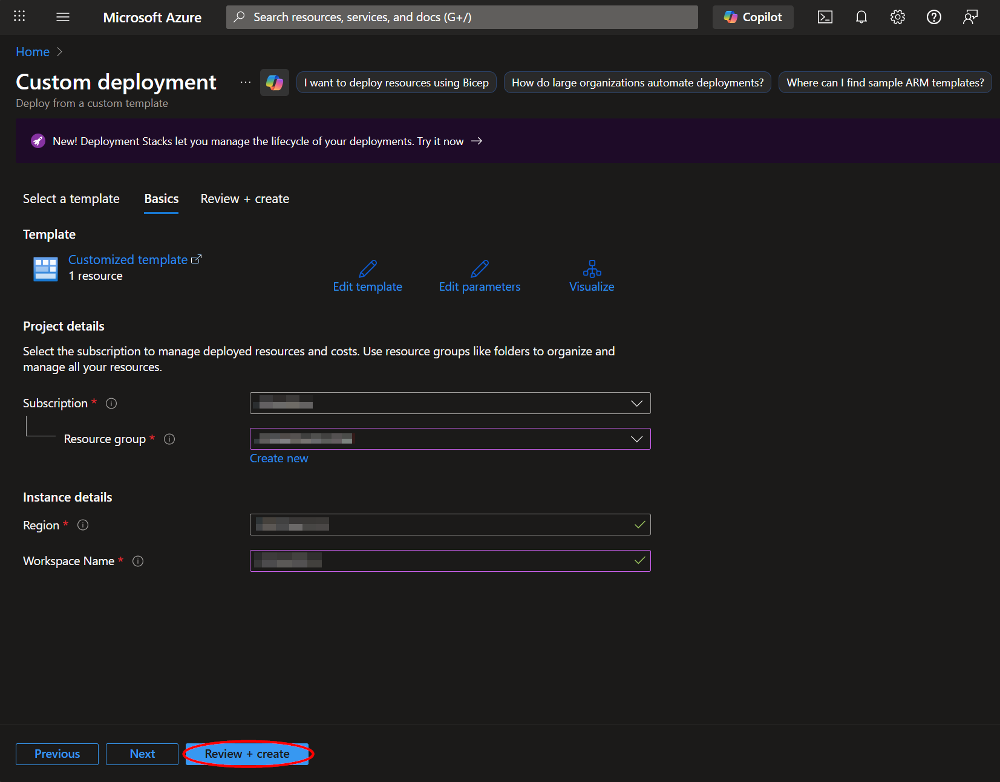

Once the resources have validated, click on "**Create**".

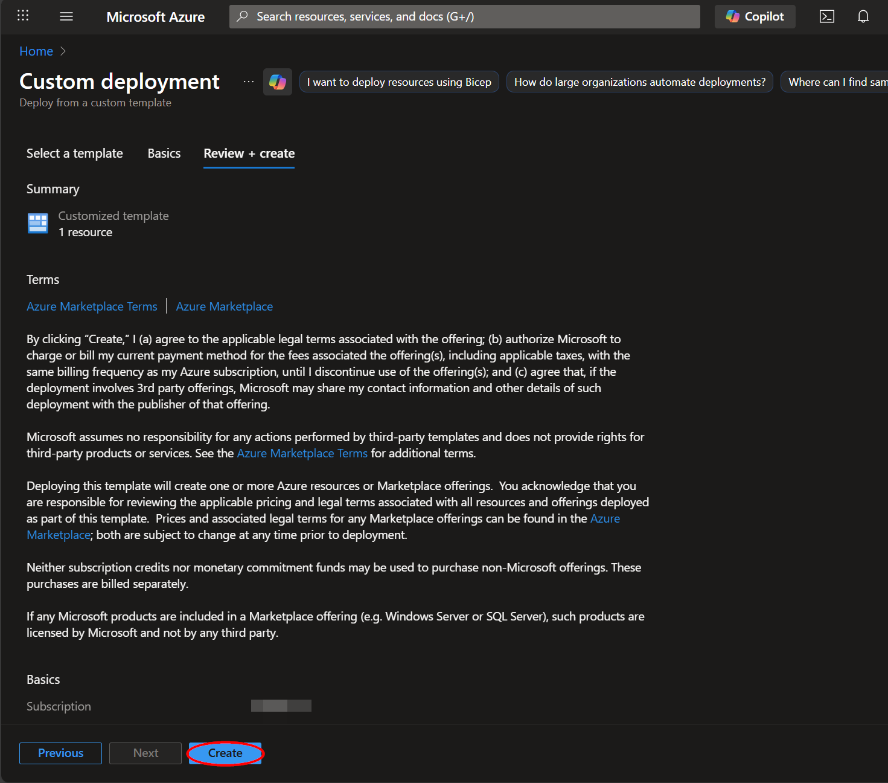


#### Deploy the Data Collection Endpoint (DCE)

The DCE provides the ingestion endpoint URL for the Logic App.

[](https://portal.azure.com/#create/Microsoft.Template/uri/https%3A%2F%2Fraw.githubusercontent.com%2FAccelerynt-Security%2FAS-CrowdStrike-Alerts-Ingestion%2Fmain%2FAzureDeployDCE.json)
[](https://portal.azure.us/#create/Microsoft.Template/uri/https%3A%2F%2Fraw.githubusercontent.com%2FAccelerynt-Security%2FAS-CrowdStrike-Alerts-Ingestion%2Fmain%2FAzureDeployDCE.json)

Click the "**Deploy to Azure**" button and it will bring you to the custom deployment template.

In the **Project details** section:

* Select the **Subscription** and **Resource group** from the dropdown boxes you would like the playbook deployed to.  

In the **Instance details** section:  
                                                  
* **Data Collection Endpoint Name**: This can be left as "**dce-crowdstrike-alerts**" or you may change it.

* **Location**: Enter the **Location** of your Log Analytics workspace referenced in [Log Analytics Workspace](https://github.com/Accelerynt-Security/AS-CrowdStrike-Alerts-Ingestion#log-analytics-workspace). Note that this may differ from the Region field, which is automatically populated based on the selected Resource group.

Towards the bottom, click on "**Review + create**". 

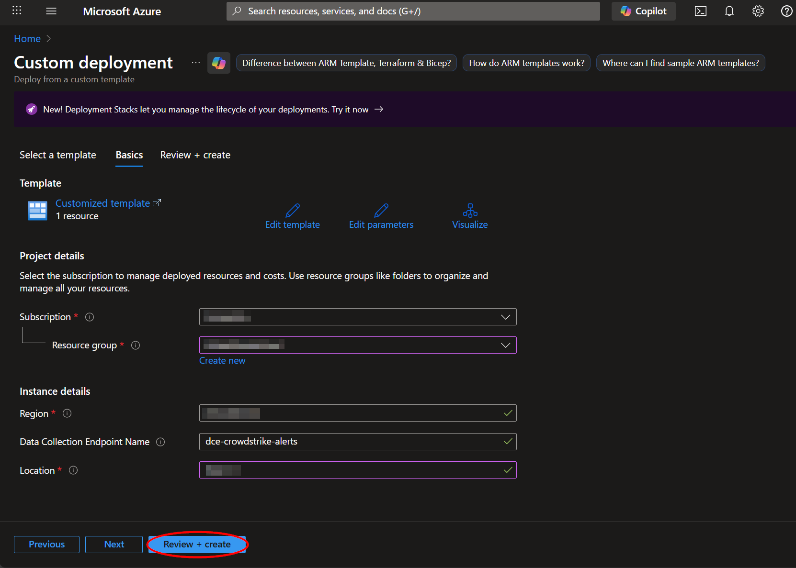

Once the resources have validated, click on "**Create**".

After deployment, navigate to the "**Outputs**" section and take note of the values listed, as these will be needed for subsequent deployment steps.

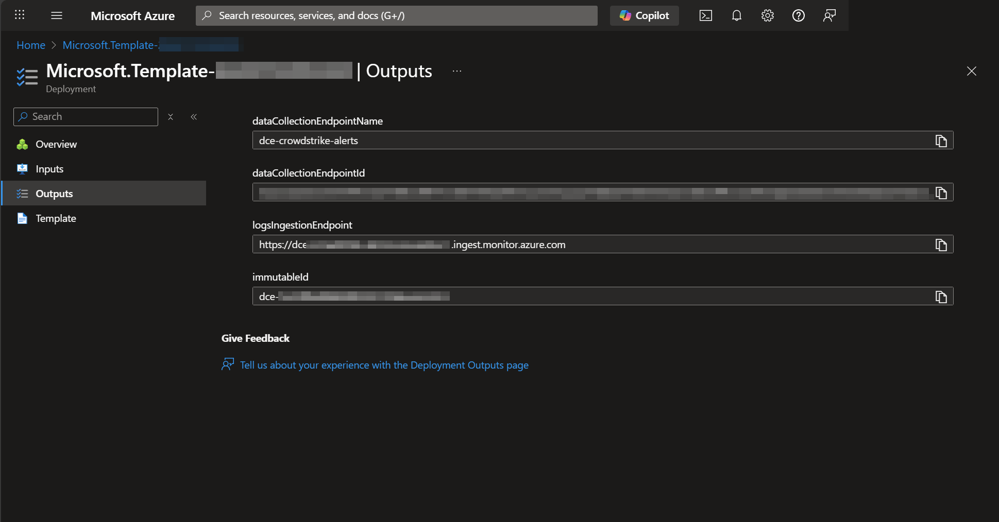


#### Deploy the Data Collection Rule (DCR)

The DCR defines the schema and destination for the ingested data.

[](https://portal.azure.com/#create/Microsoft.Template/uri/https%3A%2F%2Fraw.githubusercontent.com%2FAccelerynt-Security%2FAS-CrowdStrike-Alerts-Ingestion%2Fmain%2FAzureDeployDCR.json)
[](https://portal.azure.us/#create/Microsoft.Template/uri/https%3A%2F%2Fraw.githubusercontent.com%2FAccelerynt-Security%2FAS-CrowdStrike-Alerts-Ingestion%2Fmain%2FAzureDeployDCR.json)

Click the "**Deploy to Azure**" button and it will bring you to the custom deployment template.

In the **Project details** section:

* Select the **Subscription** and **Resource group** from the dropdown boxes you would like the playbook deployed to.  

In the **Instance details** section:  
                                                  
* **Data Collection Rule Name**: This can be left as "**dcr-crowdstrike-alerts**" or you may change it.

* **Location**: Enter the location listed on your Log Analytics Workspace.

* **Workspace Resource Id**: Enter the full resource ID of your Log Analytics workspace referenced in [Log Analytics Workspace](https://github.com/Accelerynt-Security/AS-CrowdStrike-Alerts-Ingestion#log-analytics-workspace).

* **Data Collection Endpoint Resource Id**: Enter the full resource ID of the DCE created in the previous step.

Towards the bottom, click on "**Review + create**". 

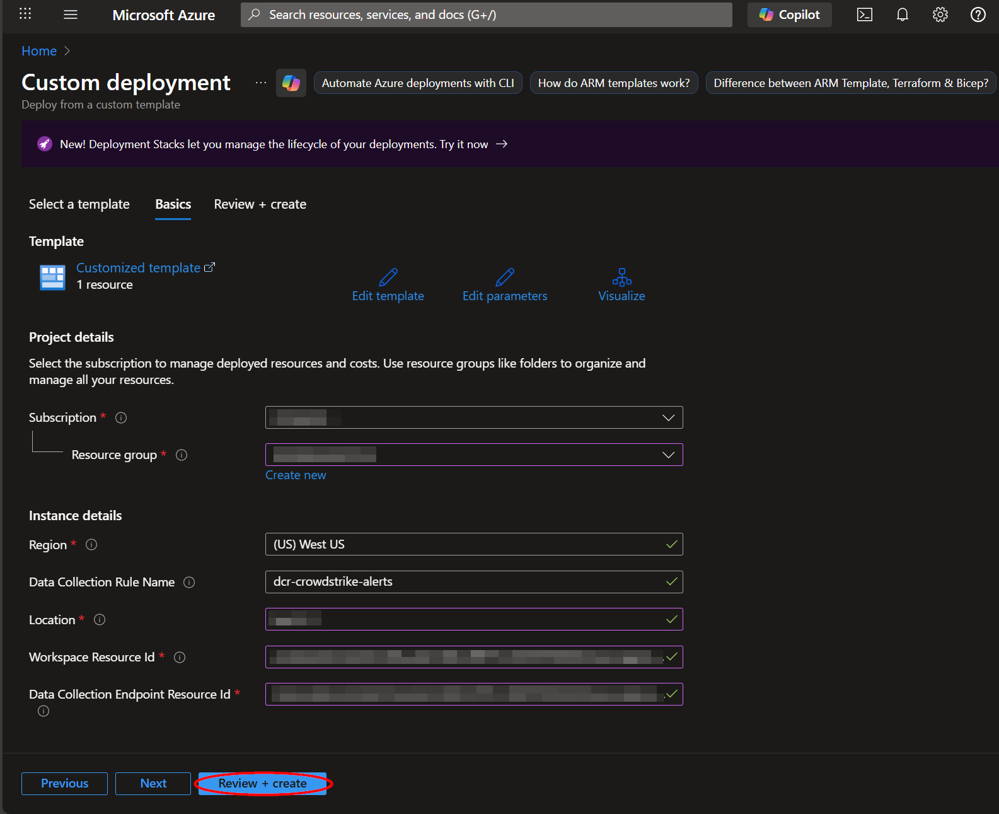

Once the resources have validated, click on "**Create**".

After deployment, navigate to the "**Outputs**" section and take note of the values listed, as these will be needed for subsequent deployment steps.

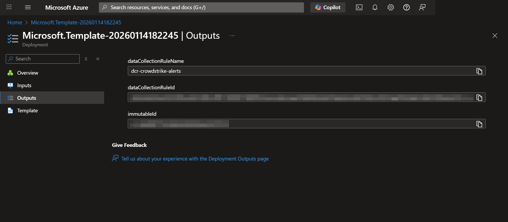


#### Deploy the Logic App Playbook

The Logic App performs the ingestion of CrowdStrike alerts every 5 minutes with built-in deduplication.

[](https://portal.azure.com/#create/Microsoft.Template/uri/https%3A%2F%2Fraw.githubusercontent.com%2FAccelerynt-Security%2FAS-CrowdStrike-Alerts-Ingestion%2Fmain%2Fazuredeploy.json)
[](https://portal.azure.us/#create/Microsoft.Template/uri/https%3A%2F%2Fraw.githubusercontent.com%2FAccelerynt-Security%2FAS-CrowdStrike-Alerts-Ingestion%2Fmain%2Fazuredeploy.json)

Click the "**Deploy to Azure**" button and it will bring you to the custom deployment template.

In the **Project details** section:

* Select the **Subscription** and **Resource group** from the dropdown boxes you would like the playbook deployed to.  

In the **Instance details** section:

* **Playbook Name**: This can be left as "**AS-CrowdStrike-Alerts-Ingestion**" or you may change it.

* **Key Vault Name**: Enter the name of the Key Vault referenced in [Create Azure Key Vault Secret](https://github.com/Accelerynt-Security/AS-CrowdStrike-Alerts-Ingestion#create-azure-key-vault-secret).

* **Key Vault Secret Name**: Enter the name of the Key Vault Secret created in [Create Azure Key Vault Secret](https://github.com/Accelerynt-Security/AS-CrowdStrike-Alerts-Ingestion#create-azure-key-vault-secret).

* **CrowdStrike Base Url**: Select the base URL of your CrowdStrike API based on your cloud region:
  - US-1: `https://api.crowdstrike.com`
  - US-2: `https://api.us-2.crowdstrike.com`
  - EU-1: `https://api.eu-1.crowdstrike.com`
  - US-GOV-1: `https://api.laggar.gcw.crowdstrike.com`

* **CrowdStrike Client Id**: Enter the CrowdStrike API client ID.

* **DCE Logs Ingestion Endpoint**: Enter the Logs Ingestion Endpoint URL from the DCE created previously.

* **DCR Immutable Id**: Enter the Immutable ID from the DCR created previously.

* **Log Analytics Workspace Name**: Enter the name of your Log Analytics workspace.

Towards the bottom, click on "**Review + create**". 

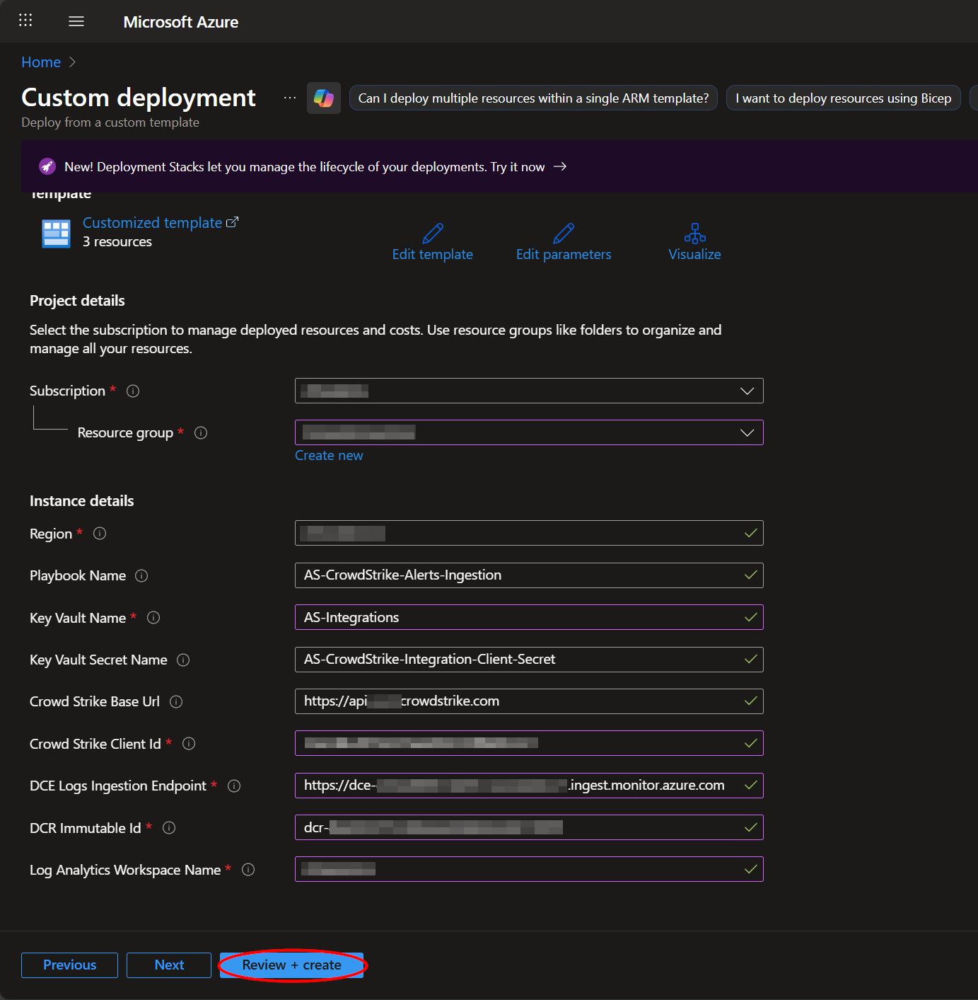

Once the resources have validated, click on "**Create**".

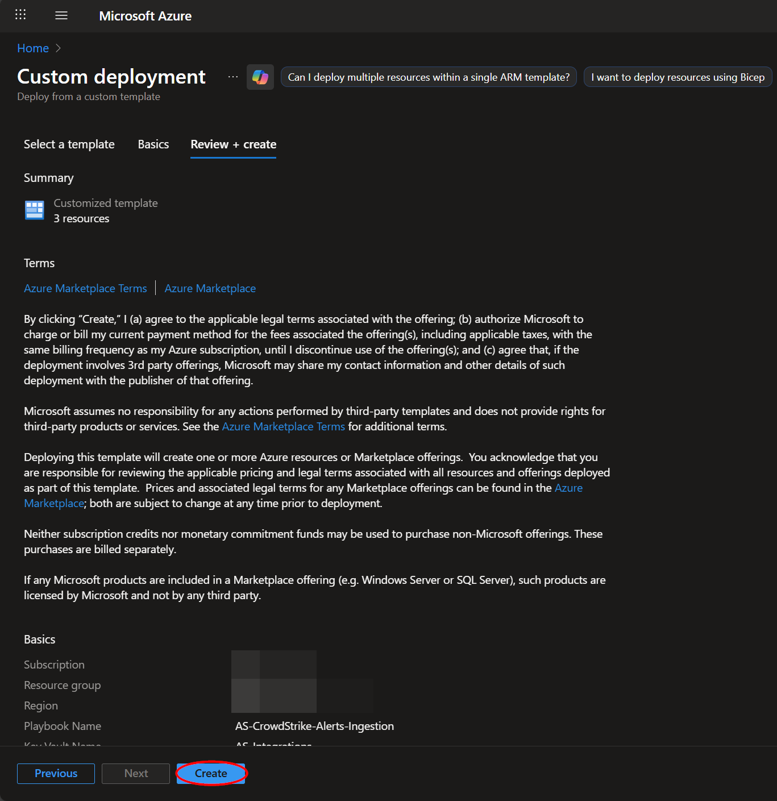

The resources should take around a minute to deploy. Once the deployment is complete, you can expand the "**Deployment details**" section to view them.
Click the one corresponding to the Logic App.

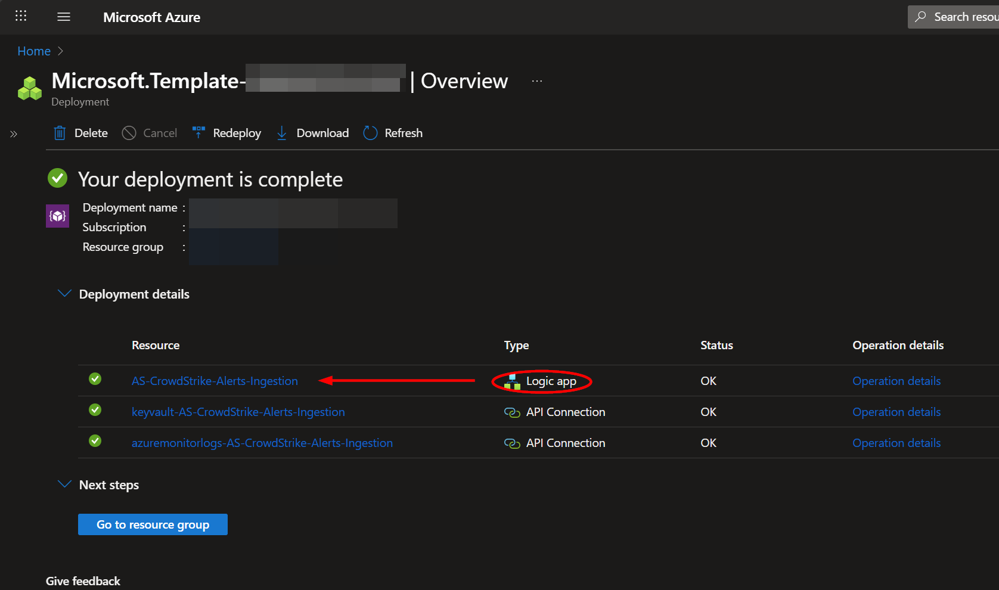

#
### Granting Access to Azure Key Vault

Before the Logic App can run successfully, the playbook must be granted access to the Key Vault storing your CrowdStrike API Client Secret.

From the Key Vault page menu, click the "**Access configuration**" menu option under the "**Settings**" section.

[](/Images/CrowdStrike_Alerts_Integration_Key_Vault_Access_1.png)

> **Note**: Azure Key Vault supports two permission models for granting data plane access: **Azure role-based access control (Azure RBAC)** and **Vault access policy**. Azure RBAC is the **recommended** authorization system, as indicated in the Azure portal. Vault access policy is considered **legacy** by Microsoft. Both methods are documented below; choose the option that matches your Key Vault's configuration.

#

#### Option 1: Azure Role-Based Access Control (Recommended)

From the Key Vault "**Access control (IAM)**" page, click "**Add role assignment**".

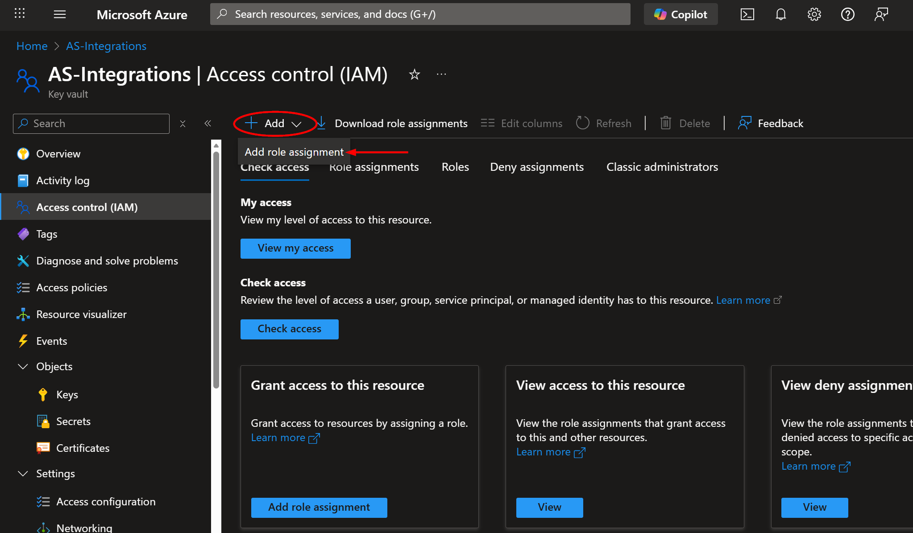

Select the "**Key Vault Secrets User**" role, then click "**Next**".


Select "**Managed identity**" and click "**Select members**". Search for "**AS-CrowdStrike-Alerts-Ingestion**" (or the playbook name you used) and click the option that appears. Click "**Select**", then "**Next**" towards the bottom of the page.

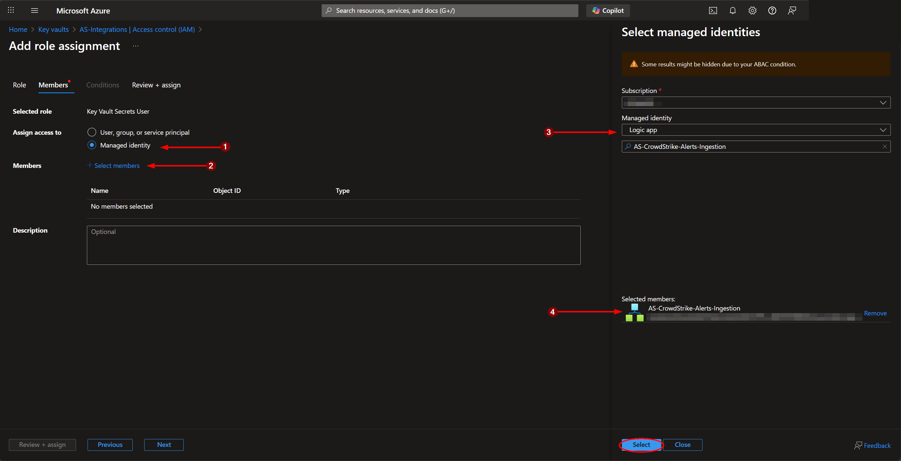

Navigate to the "**Review + assign**" section and click "**Review + assign**".

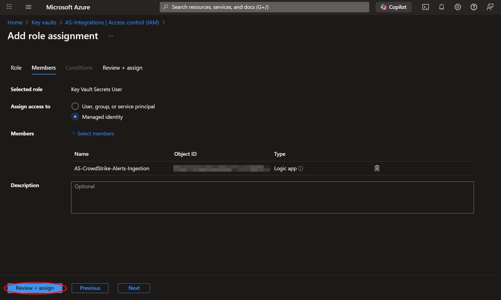


#

#### Option 2: Vault Access Policy (Legacy)

If your Key Vault is configured to use "**Vault access policy**", access must be granted through the "**Access policies**" page.

Navigate to the "**Access policies**" menu option, found under the "**Settings**" section on the Key Vault page menu.

Click "**Create**".


In the "**Permissions**" tab, select the "**Get**" checkbox under the "**Secret permissions**" section. Click "**Next**".


In the "**Principal**" tab, paste "**AS-CrowdStrike-Alerts-Ingestion**" (or the name of your playbook if you changed it during deployment) into the search box and select the option that appears. Click "**Next**".

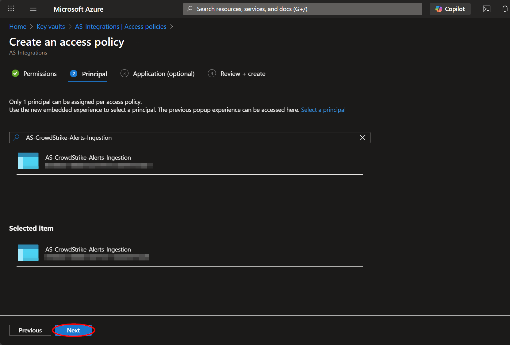

Navigate to the "**Review + create**" tab and click "**Create**".

#
### Granting Access to Data Collection Rule

The playbook must also be granted access to the Data Collection Rule to publish metrics.

From the DCR "**Access control (IAM)**" page, click "**Add role assignment**".

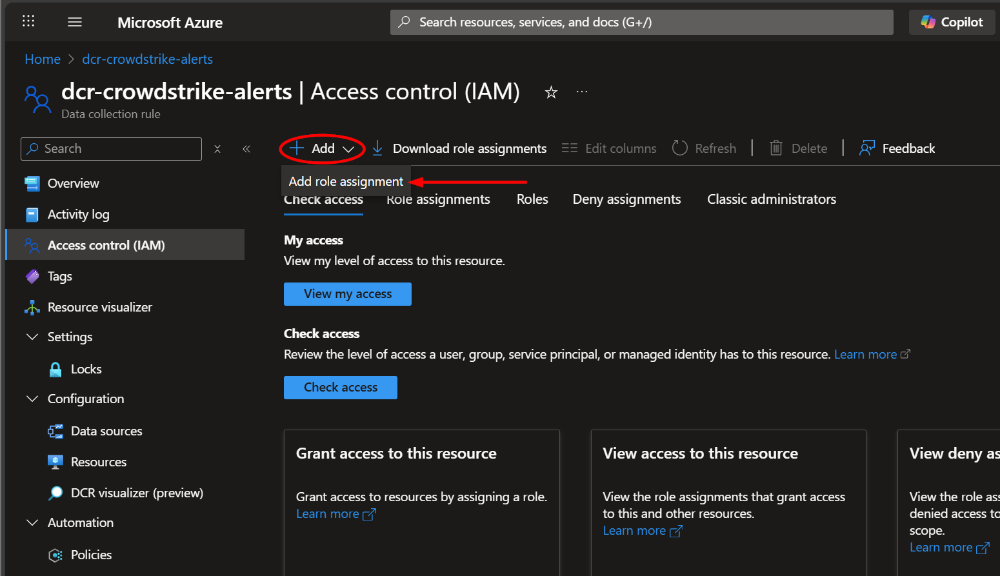

Select the "**Monitoring Metrics Publisher**" role, then click "**Next**".

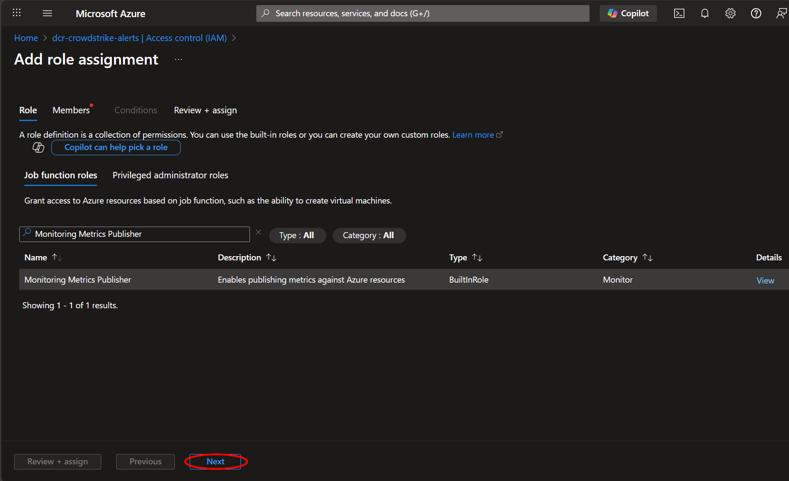

Select "**Managed identity**" and click "**Select members**". Search for "**AS-CrowdStrike-Alerts-Ingestion**" (or the playbook name you used) and click the option that appears. Click "**Select**", then "**Next**" towards the bottom of the page.

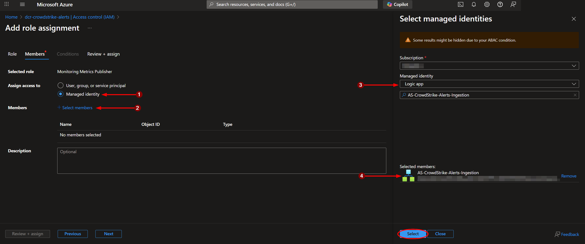

Navigate to the "**Review + assign**" section and click "**Review + assign**".

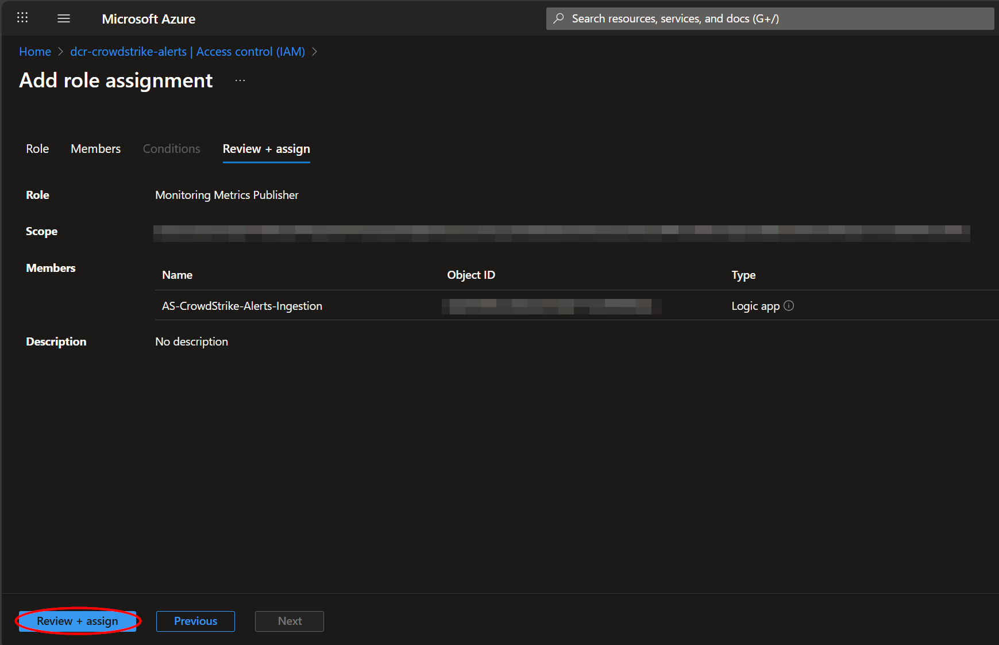

#
### Authorizing the Azure Monitor Logs API Connection

The playbook uses the Azure Monitor Logs API connection for deduplication queries. This connection must be authorized after deployment.

Navigate to the Logic App and click "**API connections**" in the left menu under "**Development Tools**". Click on the "**azuremonitorlogs-AS-CrowdStrike-Alerts-Ingestion**" connection.

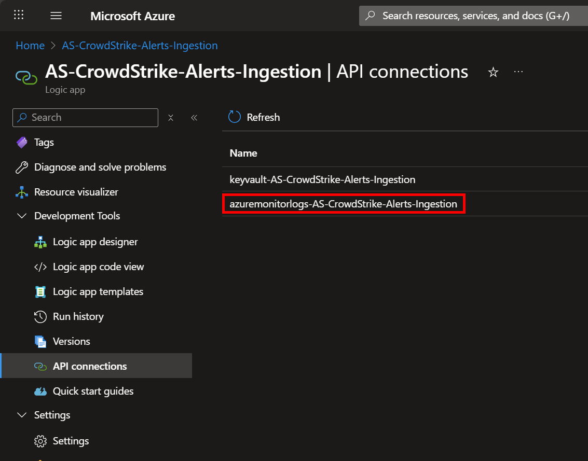

Click "**Edit API connection**" in the left menu, then click "**Authorize**". Sign in with an account that has access to the Log Analytics workspace.

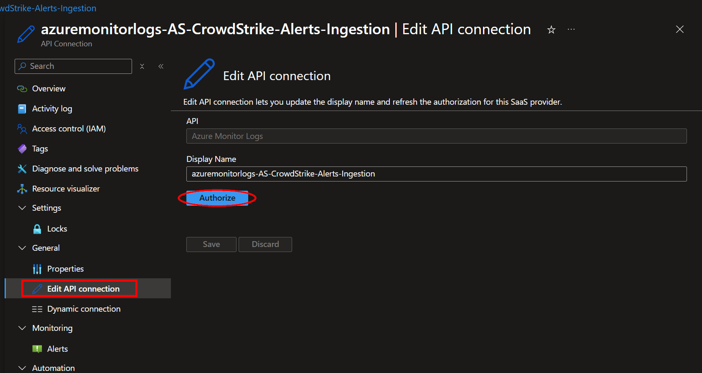

Click "**Save**".
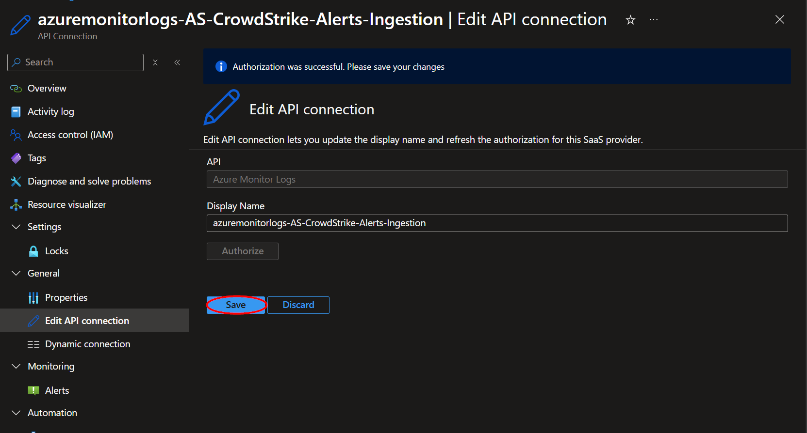

> [!IMPORTANT]  
> Each of the role assignments may take some time to propagate. If your Logic App is not running successfully immediately after the Role Assignments, please allow up to 10 minutes before retrying.

#
### Initial Run

This playbook runs every 5 minutes, collecting CrowdStrike alerts and ingesting them into Microsoft Sentinel. The playbook includes built-in deduplication that queries the existing logs to ensure only new alerts are ingested.

To execute the initial run manually, navigate to the Logic App overview page and click "**Run Trigger**" > "**Recurrence**".

Click on the run to view the execution details. Verify that all steps completed successfully, particularly the "**HTTP_-_Send_To_DCR**" step.

> [!IMPORTANT]  
> The data sent from the initial run may take longer than the five minute recurrence window to populate in the **CrowdStrike_Alerts_CL** table. To ensure duplicate records are not created on the second run, it is advised to **Disable** the Logic App until results have populated.


#
### Viewing Custom Logs

After the initial run has been completed, navigate to the Log Analytics Workspace page: https://portal.azure.com/#view/HubsExtension/BrowseResource/resourceType/Microsoft.OperationalInsights%2Fworkspaces

From there, select the workspace your deployed logic app references and click "**Logs**" in the left-hand menu blade. Expand "**Custom Logs**". Here, you should see a table called **CrowdStrike_Alerts_CL**.

> [!NOTE]  
> It may take several minutes for the table to appear and data to be visible after the initial run. If the logs are not yet visible, try querying them periodically.

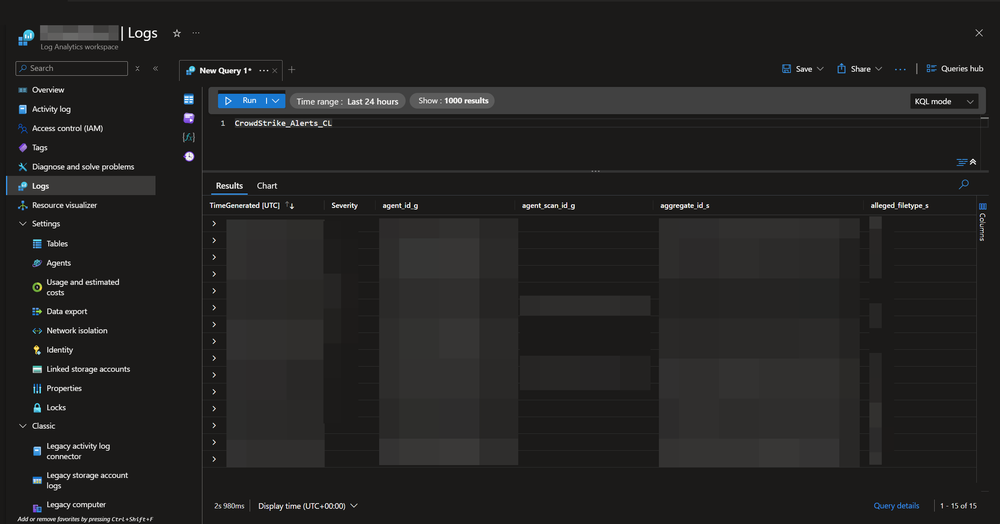

#### Sample KQL Queries

**View all alerts:**
```kql
CrowdStrike_Alerts_CL
| project TimeGenerated, Severity, severity_name_s, device_hostname_s, name_s, description_s, tactic_s, technique_s
| order by TimeGenerated desc
```

**High severity alerts in the last 24 hours:**
```kql
CrowdStrike_Alerts_CL
| where TimeGenerated > ago(24h)
| where Severity >= 80 or severity_name_s in ("Critical", "High")
| project TimeGenerated, device_hostname_s, name_s, description_s, user_name_s, falcon_host_link_s
| order by TimeGenerated desc
```

**Alerts by MITRE ATT&CK tactic:**
```kql
CrowdStrike_Alerts_CL
| where TimeGenerated > ago(7d)
| where isnotempty(tactic_s)
| summarize Count = count() by tactic_s
| order by Count desc
| render piechart
```

**Alerts by hostname:**
```kql
CrowdStrike_Alerts_CL
| where TimeGenerated > ago(7d)
| summarize AlertCount = count(), 
    HighSeverity = countif(Severity >= 80),
    Tactics = make_set(tactic_s)
    by device_hostname_s
| order by AlertCount desc
```

**Process execution alerts with command line:**
```kql
CrowdStrike_Alerts_CL
| where TimeGenerated > ago(24h)
| where isnotempty(cmdline_s) or isnotempty(command_line_s)
| project TimeGenerated, device_hostname_s, name_s, 
    CommandLine = coalesce(cmdline_s, command_line_s),
    filename_s, filepath_s, user_name_s
| order by TimeGenerated desc
```

**Alerts with network activity:**
```kql
CrowdStrike_Alerts_CL
| where TimeGenerated > ago(7d)
| where isnotempty(network_accesses_s) or isnotempty(dns_requests_s)
| project TimeGenerated, device_hostname_s, name_s, 
    network_accesses_s, dns_requests_s, device_external_ip_s
| order by TimeGenerated desc
```

**Alerts timeline:**
```kql
CrowdStrike_Alerts_CL
| where TimeGenerated > ago(7d)
| summarize Count = count() by bin(TimeGenerated, 1h), severity_name_s
| render timechart
```

#
### Data Schema

The following key fields are ingested into the **CrowdStrike_Alerts_CL** table:

| Column | Type | Description |
|--------|------|-------------|
| TimeGenerated | datetime | Time the record was ingested |
| Severity | string | Alert severity level (numeric) |
| severity_name_s | string | Alert severity name (Informational, Low, Medium, High, Critical) |
| composite_id_s | string | Unique alert identifier |
| name_s | string | Alert name |
| description_s | string | Alert description |
| device_hostname_s | string | Affected device hostname |
| device_external_ip_s | string | Device external IP address |
| device_local_ip_s | string | Device local IP address |
| device_platform_name_s | string | Platform name (Windows, Mac, Linux) |
| user_name_s | string | User associated with the alert |
| cmdline_s | string | Command line |
| filename_s | string | File name involved |
| filepath_s | string | File path involved |
| sha256_s | string | SHA256 hash of file |
| md5_g | string | MD5 hash of file |
| tactic_s | string | MITRE ATT&CK tactic |
| technique_s | string | MITRE ATT&CK technique |
| falcon_host_link_s | string | Direct link to alert in Falcon console |
| incident_id_s | string | Related incident ID |
| status_s | string | Alert status |
| RawJson_s | string | Raw JSON alert data |

> [!NOTE]  
> The table contains 200+ fields capturing comprehensive alert details including device information, process trees, MITRE ATT&CK mappings, and pattern disposition details. See the table schema for the complete field list.

#
### Role Assignments Summary

The following role assignments are required for the Logic App to function:

| Resource | Role | Purpose |
|----------|------|---------|
| Azure Key Vault | **Key Vault Secrets User** | Allows the Logic App to retrieve the CrowdStrike API client secret |
| Data Collection Rule | **Monitoring Metrics Publisher** | Allows the Logic App to send data to the DCR ingestion endpoint |

Additionally, the Azure Monitor Logs API connection must be authorized with an account that has access to the Log Analytics workspace.

#
### Troubleshooting

**Logic App fails at "Get_secret" step:**
- Verify the Key Vault name and secret name are correct
- Ensure the Logic App managed identity has the "Key Vault Secrets User" role on the Key Vault (RBAC) or appropriate access policy (legacy)

**Logic App fails at "HTTP_-_Get_Token" step:**
- Verify the CrowdStrike Base URL matches your Falcon cloud region
- Verify the CrowdStrike Client ID is correct
- Verify the client secret in Key Vault is correct

**Logic App fails at "Run_query_and_list_results_V2" step:**
- Ensure the Azure Monitor Logs API connection has been authorized
- Verify the Log Analytics workspace subscription ID, resource group, and name are correct
- Ensure the authorizing account has access to the Log Analytics workspace

**Logic App fails at "HTTP_-_Send_To_DCR" step with 403:**
- Ensure the Logic App managed identity has the "Monitoring Metrics Publisher" role on the DCR
- Wait up to 10 minutes for role assignment propagation

**Logic App fails at "HTTP_-_Send_To_DCR" step with 404:**
- Verify the DCE Logs Ingestion Endpoint URL is correct
- Verify the DCR Immutable ID is correct

**No data appearing in Log Analytics:**
- Wait several minutes after the first successful run
- Verify the custom table was created successfully
- Verify there are alerts in your CrowdStrike tenant
- Check the Logic App run history for any errors

**Duplicate alerts appearing:**
- The deduplication query checks against alerts from the last 180 days
- Ensure the custom table exists and is accessible
- Verify the Azure Monitor Logs connection is properly authorized
- Ensure the data from the previous run is populating in the Custom Logs before the next run begins
